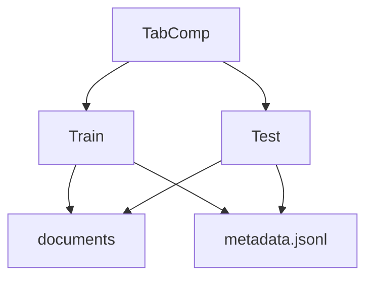

# TabComp

This repo is of Paper- TabComp: Visual Table Reading Comprehension.
Repo contains dataset TabComp whose structure is as follows:-

```mermaid
graph TD;
    TabComp-->Train;
    TabComp-->Test;
    Train-->documents;
    Test-->documents;
    Train-->metadata.jsonl
    Test-->metadata.jsonl
```
